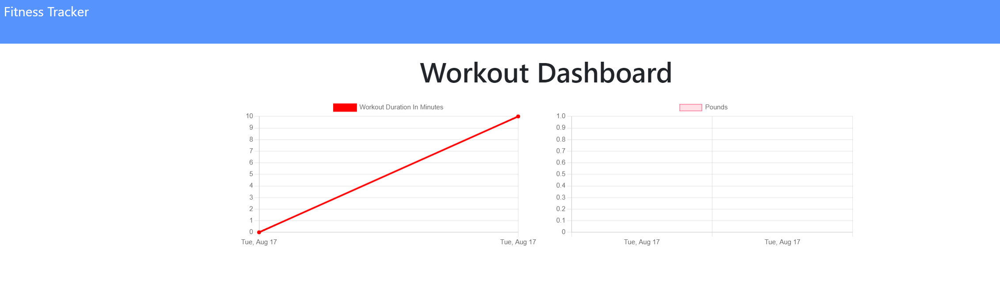

# workout-tracker  
Application to log multiple exercises in a workout on a given day. You are also able to track the name, type, weight, sets, reps, and duration of exercise. If the exercise is a cardio exercise, you will be able to track the distance traveled.

# Screenshots



## Table of Contents:
* [Installation](#installation)
* [Usage](#usage)
* [License](#license)
* [Contributing](#contributing)
* [Tests](#tests)
* [Questions](#questions)
### Installation:
To install dependencies, run the following:
```npm i```
### Usage:
once cloned to your pc, run command ```npm i``` to install the dependencies and then seed the database. run command ```npm start``` to run the application.
### License:
This project is licensed under:
none
### Contributing:
fork down the app, do your improvements and then create a well documented pull request.
### Tests:
To run the test enter the following:
```npm test```
### Questions:
If you have any questions contact me at [GitHub](https://github.com/julioPlaceres) or contact me at jplaceresvaldes@outlook.com
    
 